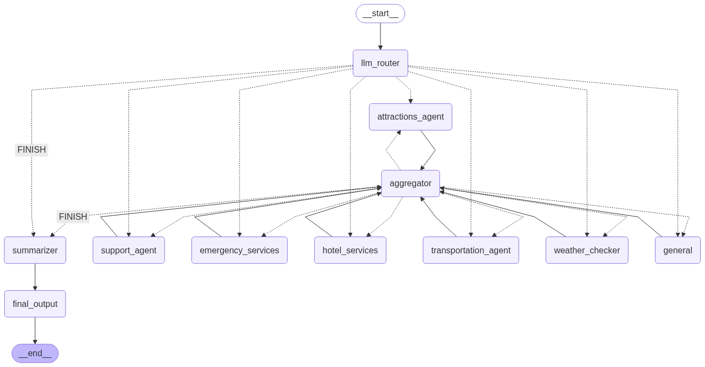

# AI Travel Companion Agent

This project implements a sophisticated, multi-agent AI travel assistant using LangGraph, LangChain, and Streamlit. It's designed to handle complex, multi-turn user queries by breaking them down into specific intents, routing them to specialized agents, and synthesizing the results into a coherent, helpful response.

## ✨ Features

-   **Multi-Agent Architecture:** Uses a `LangGraph` supervisor to route tasks to specialized agents (e.g., `flight_booking_manager`, `support_agent`).
-   **Intent-Based Routing:** An LLM-based router classifies user queries into one or more intents to determine the correct agent(s) to invoke.
-   **Tool Use:** Agents are equipped with specific tools (e.g., booking flights, checking status, FAQ lookup) to perform actions and retrieve information.
-   **Multi-LLM Support:** Easily switch between different LLM providers (Gemini, OpenAI, Claude) via environment variables.
-   **Multilingual Support:** Automatically detects the user's language, processes the query in English, and translates the final response back to the user's language.
-   **Conversational Memory:** Maintains conversation history to handle follow-up questions and context.
-   **Observability:** Integrated with Langfuse for detailed tracing and debugging of agent interactions.
-   **Interactive UIs:** Includes a Streamlit-based chat application and an admin dashboard for monitoring agent traces.

## 🛠️ Tech Stack

-   **Core Frameworks**: [LangChain](https://www.langchain.com/) & [LangGraph](https://langchain-ai.github.io/langgraph/) for building stateful, multi-agent applications.
-   **LLM Integrations**: Support for [Google Gemini](https://ai.google.dev/), [OpenAI](https://openai.com/), and [Anthropic Claude](https://www.anthropic.com/).
-   **Frontend**: [Streamlit](https://streamlit.io/) for creating the interactive chat UI and admin dashboard.
-   **Observability**: [Langfuse](https://langfuse.com/) for tracing, debugging, and monitoring agent performance.
-   **Language & Data**: Python 3.10+ and [Pandas](https://pandas.pydata.org/) for data handling.

## 🏗️ Architecture



The core of the agent is built with LangGraph, defining a stateful graph that orchestrates the flow of information:

1.  **LLM Router**: The entry point. It analyzes the user's query to identify one or more intents (e.g., `flight_booking_manager`, `flight_information`).
2.  **Agent Nodes**: For each identified intent, the graph routes the task to a specialized `ReActAgent` node. Each agent is equipped with a specific set of tools relevant to its function.
3.  **Aggregator Node**: After an agent completes its task, its output is collected and appended to an aggregated response.
4.  **Continuation Router**: This node checks if there are more intents to process. If so, it routes to the next agent; otherwise, it proceeds to the final step.
5.  **Summarizer Node**: Once all tasks are complete, this node synthesizes the aggregated results into a single, user-friendly final response.
6.  **Output Formatter**: The final response is formatted as an `AIMessage` and added to the conversation history.

## 🚀 Getting Started

### Prerequisites
-   Python 3.10+
-   An API key for your chosen LLM provider (Google Gemini, OpenAI, or Anthropic).
-   (Optional) Langfuse credentials for observability.

### Installation

1.  **Clone the repository:**
    ```bash
    git clone https://github.com/your-username/ai_hackathon.git
    cd ai_hackathon
    ```

2.  **Create and activate a virtual environment:**
    ```bash
    python -m venv .venv
    # On Windows
    .venv\Scripts\activate
    # On macOS/Linux
    source .venv/bin/activate
    ```

3.  **Install the required dependencies:**
    ```bash
    pip install -r requirements.txt
    ```

4.  **Set up your environment variables:**
    -   Copy the example `.env` file:
        ```bash
        # On Windows
        copy .env.example .env
        # On macOS/Linux
        cp .env.example .env
        ```
    -   Open the `.env` file and add your API keys and Langfuse credentials. See the Configuration section for more details.

## 🏃 Running the Applications

### 1. Interactive Chat App

This is the main user-facing application.

```bash
streamlit run apps/atca_app.py
